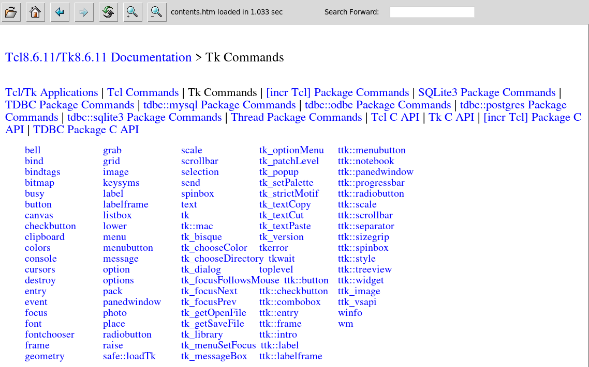

## shtmlview

### Description

The `shtmlview` package provides a pure Tcl/Tk widget to display basic HTML and
Markdown files. An installation of the Tcllib package *snit* is required. To
display Markdown files the Tcllib *Markdown* package has to be installed as
well. The package *TkImg* is required to support the display of JPEG images.

This widget is not a web browser. It will not work with http(s) addresses and
only relative filenames for images and links should be used. The widget supports
base64 encoded images embedded directly into HTML pages.

* [Manual](http://htmlpreview.github.io/?https://github.com/mittelmark/shtmlview/blob/master/shtmlview/shtmlview.html)
* [Download](https://downgit.github.io/#/home?url=https://github.com/mittelmark/shtmlview/tree/main/shtmlview)

### Standalone Application

The file `shtmlview.tcl` is not only a Tcl package but also a standalone
application for the direct viewing of Markdown and HTML files.

To display a HTML file invoke it as

```
tclsh shtmlview.tcl filename.html
```

The image below is a screen shot from when the standalone application was used
to browse the Tcl/Tk core documentation:



Invoke `tclsh shtmlview.tcl --help` in your terminal to see the embedded
documentation explaining more options.

### See also

* [Wikipage on Tclers Wiki](https://wiki.tcl-lang.org/page/shtmlview)
* [tkhtml(1)](https://github.com/wjoye/tkhtml1)
* [tkhtml3](http://tkhtml.tcl.tk/index.html)

### TODO's

* [x] svg file and inline data support using svgconvert [https://github.com/mittelmark/svgconvert/](https://github.com/mittelmark/svgconvert/) !
* [x] more investigations into the existing css functionality, keept it or throw it a away  (thrown away, we should keep it minimal)
* [x] removal of forms part (thrown away - no chance to implement a web browser)
* [ ] edit/view button to switch between view and edit mode to directly edit and save for instance a Markdown document should be a widget adaptor to not blow up the code
* [ ] help megawidget with TOC and index search such as dgHelpBrowser
